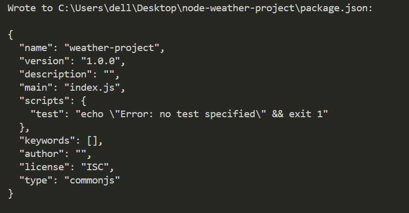
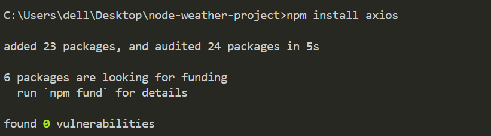
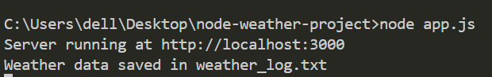
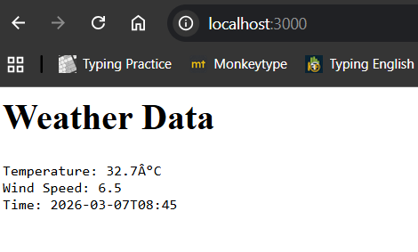

# 🌦️ Node.js Weather & CRUD Application

## 📌 Project Description

This project is a Node.js based application that performs two main tasks:

1. Fetches weather data from a public API using Axios
2. Stores and reads data using File System (fs module)
3. Demonstrates CRUD operations with different databases

This project helps in understanding Node.js architecture, asynchronous programming, and working with APIs.

---

## 🚀 Technologies Used

* Node.js
* Axios (API requests)
* File System (fs module)
* HTTP module
* MongoDB / MySQL / SQLite

---

## ⚙️ Setup Instructions

1. Install Node.js
2. Open project folder in terminal

Install dependencies:

```bash
npm install
```

Run the project:

```bash
node app.js
```

---

## 🌐 Features

* Fetch weather data from API
* Save data into `weather_log.txt`
* Display data using HTTP server
* Perform CRUD operations
* Use asynchronous (non-blocking) code

---

## 🔄 CRUD Operations

* Create → Add new data
* Read → Display stored data
* Update → Modify existing data
* Delete → Remove data

---

## 📸 Screenshots

### Weather API Output



### Data Saved in File



### Server Output (localhost)



### CRUD Operation Output



---

