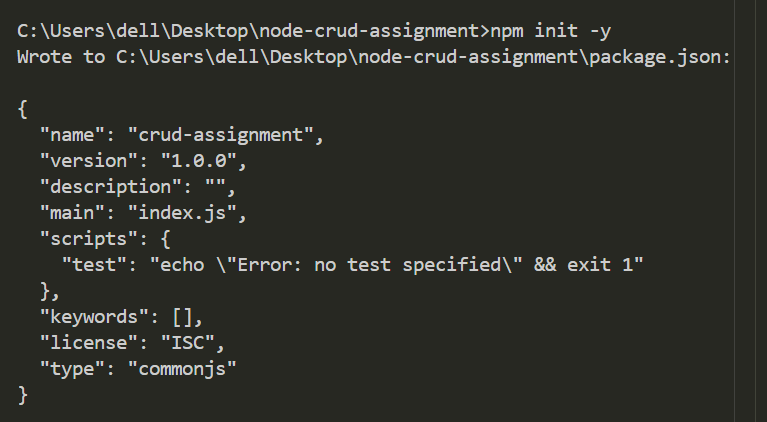
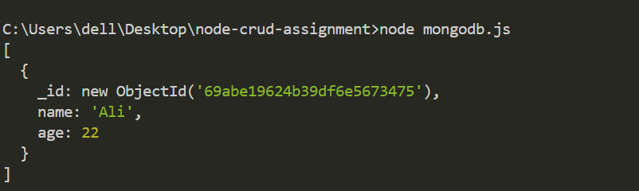
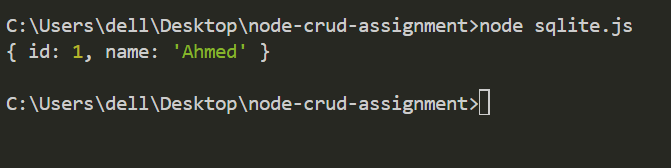

# Node.js CRUD Application (MongoDB, MySQL, SQLite)

## 📌 Project Description

This project is a CRUD (Create, Read, Update, Delete) application built using Node.js.
It demonstrates how to connect Node.js with different databases including MongoDB, MySQL, and SQLite.

The purpose of this project is to understand database connections and perform basic CRUD operations.

---

## 🚀 Technologies Used

* Node.js
* MongoDB
* MySQL
* SQLite
* NPM Packages

---

## ⚙️ Setup Instructions

1. Install Node.js
2. Open project folder in terminal
3. Install dependencies:

```bash
npm install
```

4. Run files:

```bash
node mongodb.js
node mysql.js
node sqlite.js
```

---

## 🔗 Database Connections

### 1. MongoDB

* Connected using MongoDB driver
* Performs CRUD operations

### 2. MySQL

* Connected using mysql2 package
* Handles relational database operations

### 3. SQLite

* Lightweight database
* Used for simple CRUD operations

---

## 🔄 CRUD Operations

The application performs:

* Create → Insert data into database
* Read → Fetch data from database
* Update → Modify existing records
* Delete → Remove records

---

## 📸 Screenshots

### MongoDB Output


### MySQL Output


### SQLite Output



